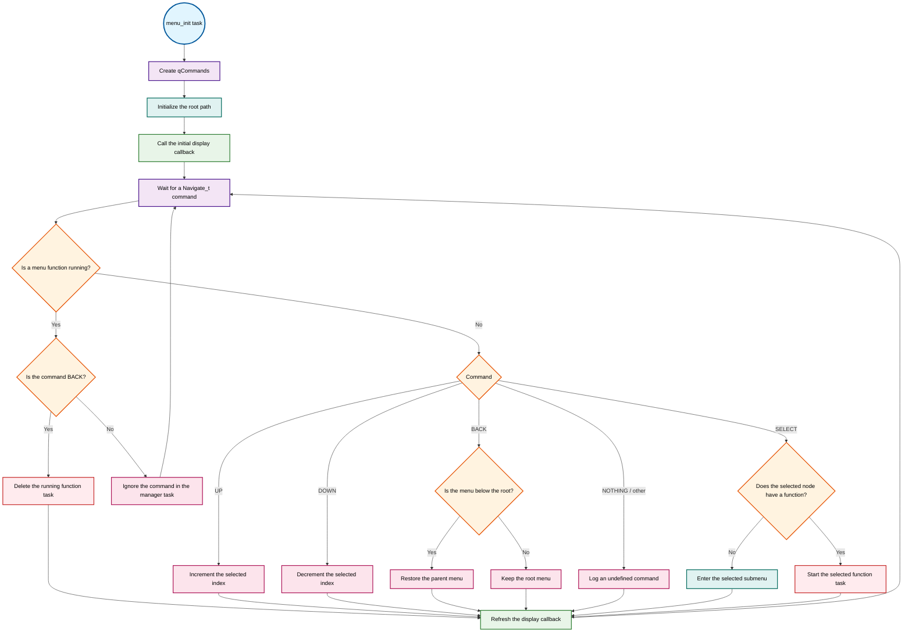

# Menu Manager

[](https://components.espressif.com/components/marciobulla/menu_manager)

Menu Manager is a small, display-independent and input-independent tree menu
component for ESP-IDF. It stores menus as nodes, receives navigation commands
through a FreeRTOS queue, calls an application-provided display callback, and
runs leaf actions as separate FreeRTOS tasks.

The component does not depend on a particular display, button, encoder, or
touch interface. Your application translates hardware events into
`Navigate_t` commands and renders the current `menu_path_t` using any output
device.

## Features

- Hierarchical menus with configurable maximum depth
- Display-agnostic rendering through an application callback
- Input-agnostic navigation through a public FreeRTOS queue
- Optional index wrapping at the beginning and end of a menu
- Leaf actions executed as independent FreeRTOS tasks
- `menuconfig` options for path depth and parent-menu index behavior
- A complete ESP-IDF project under [`examples/default`](examples/default)

## Requirements

- ESP-IDF 4.1 or newer, as declared in `idf_component.yml`
- FreeRTOS, provided by ESP-IDF

The bundled example and hardware test are verified with ESP-IDF 6.0.1.

## Installation

### ESP Component Registry

Add version 1.0.0 to an ESP-IDF project from the project root:

```bash
idf.py add-dependency "marciobulla/menu_manager^1.0.0"
```

This adds the dependency to the project's component manifest, normally
`main/idf_component.yml`. The equivalent manual declaration is:

```yaml
dependencies:
  marciobulla/menu_manager: "^1.0.0"
```

Run `idf.py reconfigure` or any normal build command to resolve and download
the component.

### Git dependency

To follow the development branch before a Registry release is available:

```yaml
dependencies:
  MarcioBulla/menu_manager:
    git: https://github.com/marciobulla/menu_manager
    version: main
```

For details about managed components, see the official
[IDF Component Manager documentation](https://docs.espressif.com/projects/idf-component-manager/en/latest/).

## Menu model

Every entry is a `menu_node_t`. A node is interpreted according to the fields
that it provides:

| Node type | `submenus` | `num_options` | `function` |
| --- | --- | ---: | --- |
| Submenu | Points to an array of child nodes | Number of children | `NULL` |
| Leaf action | Normally `NULL` | Normally `0` | FreeRTOS task function |

The root is also a `menu_node_t`. Menu Manager keeps a `menu_path_t` containing
the active menu and selected index, and passes that state to the display
callback whenever the UI needs to be rendered.

Keep the menu tree, `menu_config_t`, labels, and child arrays valid for the
entire lifetime of the menu task. Static storage is the simplest option.

## Minimal example

```c
#include "menu_manager.h"
#include <freertos/FreeRTOS.h>
#include <freertos/queue.h>
#include <freertos/task.h>
#include <stdio.h>

static void show_message(void *args)
{
    (void)args;
    printf("Leaf action selected\n");

    /* Refresh the menu, clear tMenuFunction, and delete this task. */
    exitFunction();
}

static menu_node_t root_options[] = {
    {
        .label = "Run action",
        .function = show_message,
    },
};

static void display_menu(menu_path_t *path)
{
    menu_node_t *menu = path->current_menu;
    menu_node_t *selected = &menu->submenus[path->current_index];

    printf("%s > %s\n", menu->label, selected->label);
}

static menu_config_t menu_config = {
    .root = {
        .label = "Main menu",
        .submenus = root_options,
        .num_options = sizeof(root_options) / sizeof(root_options[0]),
    },
    .display = display_menu,
    .loop = true,
};

void app_main(void)
{
    xTaskCreate(
        menu_init,
        "menu_manager",
        4096,
        &menu_config,
        3,
        NULL
    );
}
```

After `menu_init()` creates `qCommands`, an input callback can send commands
from a button, encoder, keypad, or another task:

```c
static void send_navigation(Navigate_t command)
{
    if (qCommands != NULL) {
        xQueueSend(qCommands, &command, 0);
    }
}

/* Examples: */
send_navigation(NAVIGATE_UP);
send_navigation(NAVIGATE_SELECT);
```

Do not send input before `qCommands` has been created.

## Runtime flowchart



## Navigation commands

| Value | Behavior |
| --- | --- |
| `NAVIGATE_UP` | Increments `current_index`. At the last item it wraps to zero only when `menu_config_t.loop` is `true`. |
| `NAVIGATE_DOWN` | Decrements `current_index`. At item zero it wraps to the last item only when `loop` is `true`. |
| `NAVIGATE_SELECT` | Starts the selected leaf function or enters the selected submenu. |
| `NAVIGATE_BACK` | Returns to the parent menu. At the root it leaves the path unchanged. While a leaf function is running, it can stop that task. |
| `NAVIGATE_NOTHING` | Sentinel value. If sent to the manager, it is handled as an undefined command. |

## Data structures

### `menu_node_t`

Describes one menu node.

| Field | Description |
| --- | --- |
| `char *label` | Text associated with the node. |
| `menu_node_t *submenus` | Array of child nodes for a submenu. |
| `size_t num_options` | Number of elements in `submenus`. |
| `void (*function)(void *args)` | Leaf task entry point. A non-`NULL` value makes the selected node executable. |

Menu Manager passes `NULL` as `args` when it starts a selected leaf.

### `menu_path_t`

Represents the state supplied to the display callback.

| Field | Description |
| --- | --- |
| `menu_node_t *current_menu` | Active submenu or root node. |
| `uint8_t current_index` | Selected child within `current_menu`. |

The callback receives a pointer to live internal state. Read it during the
callback; do not free it or replace its pointers.

### `menu_config_t`

Configures the manager task.

| Field | Description |
| --- | --- |
| `menu_node_t root` | Root of the menu tree. |
| `void (*display)(menu_path_t *current_path)` | Required rendering callback. |
| `bool loop` | Enables wraparound navigation when `true`; clamps at both ends when `false`. |

## Public API

### `void menu_init(void *params)`

Initializes the command queue and root path, renders the initial menu, and then
waits indefinitely for navigation commands.

- `params` must point to a valid `menu_config_t`.
- The function is a long-running FreeRTOS task entry point and does not return.
- It creates `qCommands` with room for 10 `Navigate_t` values.
- The configuration and menu tree must remain alive while the task runs.

### `void exitFunction(void)`

Ends the currently running leaf action.

- Refreshes the menu through the configured display callback.
- Clears `tMenuFunction`.
- Deletes the calling task with `vTaskDelete(NULL)`.

Call this from a leaf task instead of returning from the task function.

### `void execFunction(void (*function)(void *args))`

Starts an arbitrary function as the current menu function.

- Passes `NULL` as the new task's argument.
- Uses task name `Function_by_menu`.
- Uses a 10,240-byte stack and priority 10, with no core affinity.
- Stores the new task handle in `tMenuFunction`.
- Delays the calling task for one second after task creation.

This helper is separate from the normal selection path and is mainly useful
when one menu action needs to launch another managed action.

### `void setQuick_menuFunction(void)`

Immediately calls the configured display callback with the current path. It
does not modify the path, clear `tMenuFunction`, or delete a task.

The public `SET_QUICK_FUNCTION` macro expands to this call.

## Public task and queue handles

| Symbol | Purpose |
| --- | --- |
| `QueueHandle_t qCommands` | Receives `Navigate_t` input events. Check that it is not `NULL` before sending. |
| `TaskHandle_t tMenuFunction` | Tracks the active leaf task. Applications should treat it as read-only state. |

## Internal runtime functions

These functions are private to `menu_manager.c`, but their behavior explains
the navigation rules:

| Function | Responsibility |
| --- | --- |
| `NavigationUp(bool loop)` | Advances the selected index and optionally wraps to zero. |
| `NavigationDown(bool loop)` | Moves to the previous index and optionally wraps to the last item. |
| `ExecFunction(void)` | Starts the selected leaf as a FreeRTOS task and records its handle. C identifiers are case-sensitive; this is different from the public `execFunction()`. |
| `SelectionOption(void)` | Enters the selected submenu, resets its index to zero, increments the depth, and records the path. |
| `NavigationBack(void)` | Decrements the depth and restores the stored parent path. It resets the restored index when `CONFIG_SALVE_INDEX` is disabled. |

## Kconfig options

Open the component settings with:

```bash
idf.py menuconfig
```

Then select **Menu Menager**.

| Option | Default | Description |
| --- | ---: | --- |
| `CONFIG_MAX_DEPTH_PATH` | `5` | Size of the internal path stack. The component does not perform a runtime bounds check, so the menu tree must not exceed this limit. |
| `CONFIG_SALVE_INDEX` | Enabled | When disabled, returning to a parent forces its selected index to zero. When enabled, the restored stack entry is left unchanged. |

The configuration symbols retain their current spelling for API compatibility.

## Running the bundled example

The [`examples/default`](examples/default) project builds a three-level menu,
prints complete menu blocks with `printf()`, and uses `ESP_LOGI()` to identify
the simulated `UP`, `DOWN`, `SELECT`, and `BACK` commands separately.
The display prints options in descending index order, so `NAVIGATE_UP` moves
the selection marker upward on the terminal and `NAVIGATE_DOWN` moves it
downward.

Its manifest uses `override_path` to build against the local component source,
which is the layout recommended for Registry-packaged examples.

```bash
cd examples/default
idf.py set-target esp32
idf.py build flash monitor
```

The example functions are:

| Function | Purpose |
| --- | --- |
| `dumb(void *args)` | Example long-running leaf action. |
| `simula_input(void *args)` | Sends a timed sequence of navigation commands to `qCommands` and logs each received input command. |
| `display(menu_path_t *current_path)` | Prints the complete current menu and marks the selected item with `>`. |
| `app_main(void)` | Creates the menu manager task and simulated-input task. |

See [`examples/default/main/main.c`](examples/default/main/main.c) for the full
source.

### Python hardware test

[`examples/default/pytest_default.py`](examples/default/pytest_default.py)
uses `pytest-embedded` to flash a connected ESP32 and verify every menu
transition produced by the simulated input task. Its Python dependencies and
pytest defaults are declared in
[`examples/default/pyproject.toml`](examples/default/pyproject.toml).

From an activated ESP-IDF environment, let `uv` create the test environment:

```bash
cd examples/default
idf.py set-target esp32
idf.py build
uv sync --locked
uv run --locked pytest pytest_default.py \
  --embedded-services esp,idf \
  --app-path . \
  --build-dir build \
  --port /dev/ttyUSB0
```

`uv sync --locked` creates `examples/default/.venv` from `pyproject.toml` using
the exact versions recorded in
[`examples/default/uv.lock`](examples/default/uv.lock). `uv run --locked` then
executes pytest in that project environment while retaining `IDF_PATH` and the
ESP-IDF toolchain settings from the activated shell.

Replace `/dev/ttyUSB0` with the serial port used by your board. The test checks
the initial root selection, submenu entry, wrapped downward navigation, leaf
task execution, leaf exit, parent navigation, and the final simulation
message.

## Real-world example: PhotogateV2

[PhotogateV2](https://github.com/marciobulla/PhotogateV2) uses Menu Manager in
an ESP32 optical timer:

- [`menus.c`](https://github.com/MarcioBulla/PhotogateV2/blob/main/firmware/main/core/menus.c)
  defines the multi-level tree, assigns experiment functions to leaf nodes,
  and registers `showDisplay()` as the Menu Manager display callback.
- [`display.c`](https://github.com/MarcioBulla/PhotogateV2/blob/main/firmware/main/hardware/display.c)
  provides the I2C LCD handle, display semaphore, initialization, and
  brightness control used by `showDisplay()` to render the current menu.
- [`cronos.c`](https://github.com/MarcioBulla/PhotogateV2/blob/main/firmware/main/core/cronos.c)
  implements `run_experiment()` and the experiment state handlers entered by
  the menu's executable leaf actions.
- [`encoder.c`](https://github.com/MarcioBulla/PhotogateV2/blob/main/firmware/main/hardware/encoder.c)
  converts rotary encoder and button callbacks into `Navigate_t` messages sent
  to `qCommands`.
- Menu actions can consume navigation input for their own UI and call
  `exitFunction()` when they finish.

This project is a useful reference for connecting a physical encoder, a
character display, and application-specific tasks to the generic menu model.

## Concurrency and lifecycle notes

- The display callback runs at startup and after handled navigation changes. It
  can also be called by `exitFunction()` or `setQuick_menuFunction()`, so protect
  shared display hardware if other tasks use it.
- A selected leaf is a FreeRTOS task, not a normal callback. It must remain
  running or terminate itself with `exitFunction()`.
- While a leaf task is active, the manager handles `NAVIGATE_BACK` as a request
  to delete that task and ignores other commands that it receives.
- A leaf may read `qCommands` directly to implement an interactive screen, as
  demonstrated by PhotogateV2.
- Queue sends from interrupt context must use the corresponding FreeRTOS
  `FromISR` API.
- Leaf tasks use `xTaskCreate()` without core affinity, so the scheduler can
  place them on either single-core or multi-core targets.

## Repository layout

```text
.
├── CMakeLists.txt
├── Kconfig
├── idf_component.yml
├── include/
│   └── menu_manager.h
├── menu_manager.c
└── examples/
    └── default/
```

Issues and feature requests can be reported in the
[GitHub issue tracker](https://github.com/marciobulla/menu_manager/issues).

## License

Copyright (c) 2026 Marcio Bulla.

Menu Manager is released under the [Apache License 2.0 (Apache-2.0)](LICENSE).
